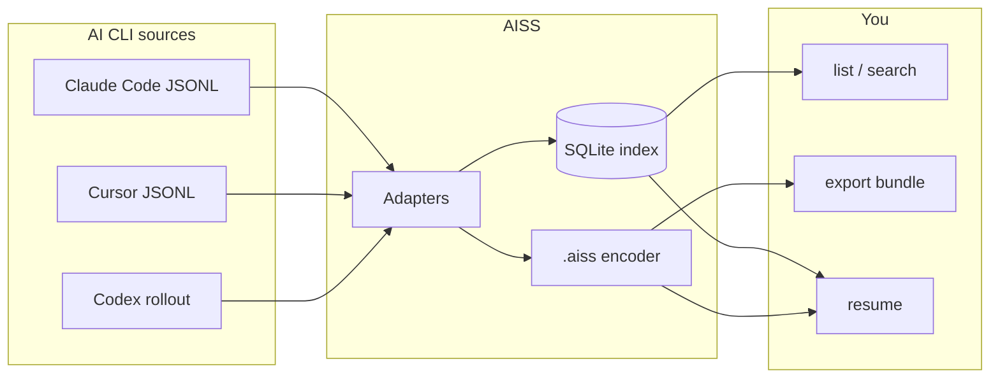

# AI Code Session Saver (AISS)

**Capture, index, encode, and resume AI coding CLI sessions** — so you never lose context when a terminal closes, a machine reboots, or you switch tools.

Supports **Claude Code CLI**, **Cursor Agent**, and **Codex CLI** today, with a pluggable adapter architecture for more tools (Aider, OpenCode, Gemini CLI, etc.).

## The problem

Every AI CLI stores sessions differently:

| Tool | Where sessions live | Resume mechanism |
|------|---------------------|------------------|
| Claude Code | `~/.claude/projects/<hash>/*.jsonl` + `history.jsonl` index | `claude --resume <id>` |
| Cursor | `~/.cursor/projects/*/agent-transcripts/*.jsonl` | Manual (SQLite for full agent mode) |
| Codex CLI | `~/.codex/sessions/**/rollout-*.jsonl` | `codex resume <id>` |

Sessions get orphaned (VS Code extension sessions missing from `history.jsonl`), lost on disk cleanup, or trapped on one machine. **AISS** normalizes all of this into one index + portable encoded bundles you can search, back up, share, and restore.

## How it works



### 1. Capture & index

Adapters read each tool's native transcript format and normalize messages into a **unified session model**. Sessions are indexed in SQLite at `~/.aicode-session-saver/index.db` with project path, provider, timestamps, and message counts.

### 2. Encoded bundles (`.aiss`)

Each session is also saved as a **gzip-compressed, checksum-verified** `.aiss` bundle containing:

- Normalized transcript (messages + connections between parent/child sessions)
- Raw source files (original JSONL for lossless round-trip)
- Resume metadata (native CLI commands where available)

Bundles can be exported as **base64** for pasting into tickets, docs, or cloud storage.

### 3. Resume

- **Claude Code**: `aiss resume <id> --apply` restores the JSONL transcript + `history.jsonl` entry, then run `claude --resume <id>`
- **Codex**: prints `codex resume <id>`
- **Cursor / others**: generates a **context prompt** with recent conversation history to paste into a new chat

## Quick start

```bash
git clone https://github.com/randhirk/AICodeSessionSaver
cd aicode-session-saver
npm install
npm run build

# One-time scan of all detected AI CLIs
npx aiss sync

# Or watch for changes in real time
npx aiss watch

# List sessions
npx aiss list
npx aiss list --provider claude-code --project AICodeSessionSaver

# Export portable bundle
npx aiss export 8dddce78 -o my-session.aiss
npx aiss export 8dddce78 --base64   # encoded string

# Import on another machine
npx aiss import my-session.aiss

# Resume where you left off
npx aiss resume 8dddce78 --apply
npx aiss resume 8dddce78 --context-out continue.md
```

## CLI reference

| Command | Description |
|---------|-------------|
| `aiss providers` | Show detected AI CLI data directories |
| `aiss sync` | Scan and index all sessions |
| `aiss watch` | Auto-sync on transcript file changes |
| `aiss list` | List indexed sessions |
| `aiss show <id>` | Full session JSON |
| `aiss export <id>` | Write `.aiss` bundle (or `--base64`) |
| `aiss import <file>` | Import bundle into local index |
| `aiss decode <file>` | Decode bundle to JSON |
| `aiss resume <id>` | Resume instructions (`--apply` for Claude Code) |

## Environment variables

| Variable | Default | Purpose |
|----------|---------|---------|
| `AISS_DATA_DIR` | `~/.aicode-session-saver` | Index + bundle storage |
| `AISS_EXTRA_ROOTS` | — | Comma-separated extra transcript directories |
| `CLAUDE_CONFIG_DIR` | `~/.claude` | Claude Code data root |
| `CODEX_HOME` | `~/.codex` | Codex CLI data root |

## `.aiss` bundle format (v1)

```json
{
  "format": "aiss",
  "version": 1,
  "encodedAt": "2026-06-24T...",
  "session": { "id", "provider", "messages", "connections", ... },
  "raw": { "transcript.jsonl": { "encoding": "utf8", "content": "..." } },
  "checksum": "sha256..."
}
```

The file on disk is **gzip-compressed JSON**. Checksum covers all fields except itself, so corrupted transfers are detected on import.

## Roadmap

- [ ] Aider, OpenCode, Gemini CLI adapters
- [ ] Cursor SQLite adapter (full agent-mode resume with checkpoints)
- [ ] Web UI for cross-session search
- [ ] Git-synced backup directory
- [ ] Hook integration (capture on session start/end)
- [ ] Cloud export (S3, Gist)

## Contributing

Adapters live in `src/adapters/`. Each adapter implements:

```ts
interface SessionAdapter {
  provider: Provider;
  isAvailable(): boolean;
  discoverSessions(): Promise<UnifiedSession[]>;
  watchPaths(): string[];
}
```

PRs welcome for new CLI support.

## License

MIT
